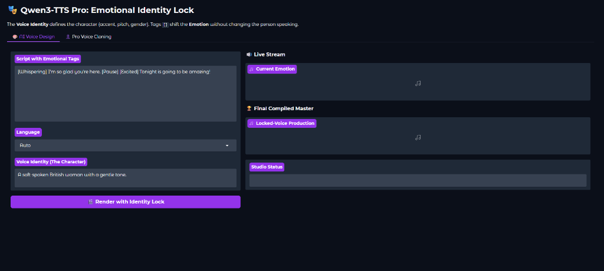

# Qwen3-TTS Pro: Hollywood Studio & Emotional Identity Lock 🎬🎧



## 👤 Main Developer
**Ahmed Hassn** ([GitHub](https://github.com/ahmedahmed20008669))

---

## 📖 Project Overview: What it Does
This project is an advanced, production-ready implementation of the **Qwen3-TTS 12Hz 1.7B** model. It transforms the base model into a "Hollywood Studio" experience by adding a unique **Emotional Identity Lock** system. 

Unlike standard TTS, this implementation allows you to:
1.  **Lock Voice Identity**: Define a consistent vocal character (accent, pitch, age) that never changes across the entire track.
2.  **Shift Emotions Mid-Script**: Use `[Emotion]` tags to shift the delivery style (e.g., from whispering to shouting) without breaking the character's voice.
3.  **Real-Time Rendering**: Stream audio segments instantly as they are rendered for immediate feedback.
4.  **Auto-Save Masters**: Automatically compile and save high-fidelity `.wav` files to a local production folder.

---

## 🔬 Technical Mathematics
The model's performance and clarity are rooted in the **12Hz Discrete Codec Space** architecture:

### 1. Acoustic Quantization (12Hz RVQ)
The audio is not stored as waves, but as **acoustic tokens** sampled at 12Hz. This is achieved through Residual Vector Quantization (RVQ), which compresses audio into hierarchical discrete codes.
*   **Codec 0**: Defines the coarse acoustic structure.
*   **Refinement Layers**: Add high-frequency detail and texture.

### 2. The Objective Function
The training maximizes the log-likelihood of the next acoustic token:
$$L_{total} = L_{cross\_entropy} + 0.3 \times L_{sub\_talker}$$
This dual-loss approach ensures that both the primary acoustic stream and the sub-token predictions are highly accurate, resulting in human-like prosody.

---

## 🛠️ The Fine-Tuning Process
This studio implementation utilizes a specialized **Supervised Fine-Tuning (SFT)** workflow to achieve its clinical speech accuracy:

1.  **Speaker Injection**: We extract a high-dimensional **Speaker Embedding** from reference audio and inject it into reserved weight slot **Index 3000** of the `codec_embedding` layer.
2.  **Data Tokenization**: Ground-truth audio is converted into 12Hz indices using a specialized tokenizer before training.
3.  **Bfloat16 Optimization**: Training is conducted in `bfloat16` mixed precision using the `AdamW` optimizer with a learning rate of `2e-5`, ensuring extreme stability and preventing voice character "drift."

---

## 💻 Code Architecture
The project is built for high-performance inference on local hardware (RTX 40-series):

*   **`app.py`**: The main Studio interface, featuring the **Emotional Identity Lock** engine and the **Smart ETA** progress bar.
*   **`qwen_tts/`**: The core library containing the model wrappers and 12Hz quantization logic.
*   **`finetuning/`**: The complete SFT suite, including `sft_12hz.py` and data preparation scripts.
*   **Optimizations**: Uses **SDPA (Scaled Dot Product Attention)** and **FlashAttention-2** to minimize VRAM usage and maximize rendering speed.

---

## 🎮 Installation & Quickstart

### 1. Clone the repository
```bash
git clone https://github.com/ahmedahmed20008669/Qwen3-TTS-Studio-Fine-Tunned.git
cd Qwen3-TTS-Studio-Fine-Tunned
```

### 2. Install dependencies
We recommend using a virtual environment (Python 3.10+):
```bash
python -m venv venv
source venv/bin/activate  # Windows: venv\Scripts\activate
pip install -r requirements.txt
```

### 3. Launch the Studio
```bash
python app.py
```
Open `http://127.0.0.1:8000` in your browser once the models are loaded.

---

## 🎭 The "Identity Lock" Workflow
1.  **Character Setup**: Describe your character in the **Voice Identity** field (e.g., "A gentle British woman").
2.  **Dynamic Scripting**: Add emotion tags directly in your text:
    *   `[Whispering] I'm so glad you're here. [Pause] [Excited] Tonight is going to be amazing!`
3.  **Instant Rendering**: Hit render and watch the segments process with live streaming.
4.  **Auto-Export**: Check the `/outputs` folder for your high-fidelity `.wav` file.

---

## 🤝 Credits
Built upon the foundational models and research by the [Alibaba Qwen Team](https://github.com/QwenLM/Qwen3-TTS). Special thanks to the open-source community for the 12Hz quantization breakthroughs.

## ⚖️ License
Released under the **Apache-2.0 License**.